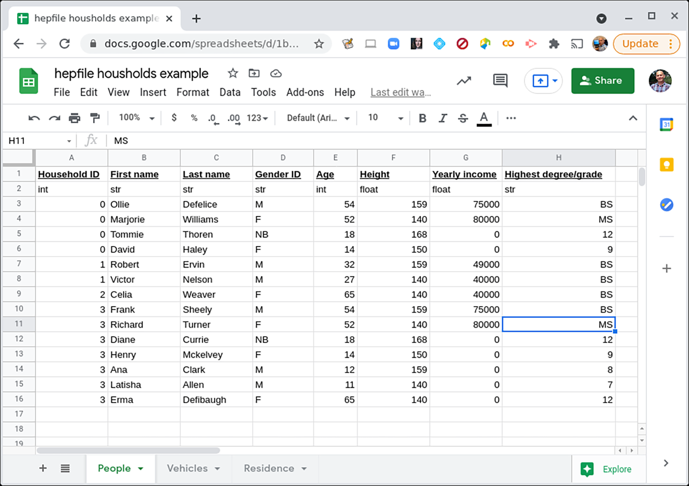
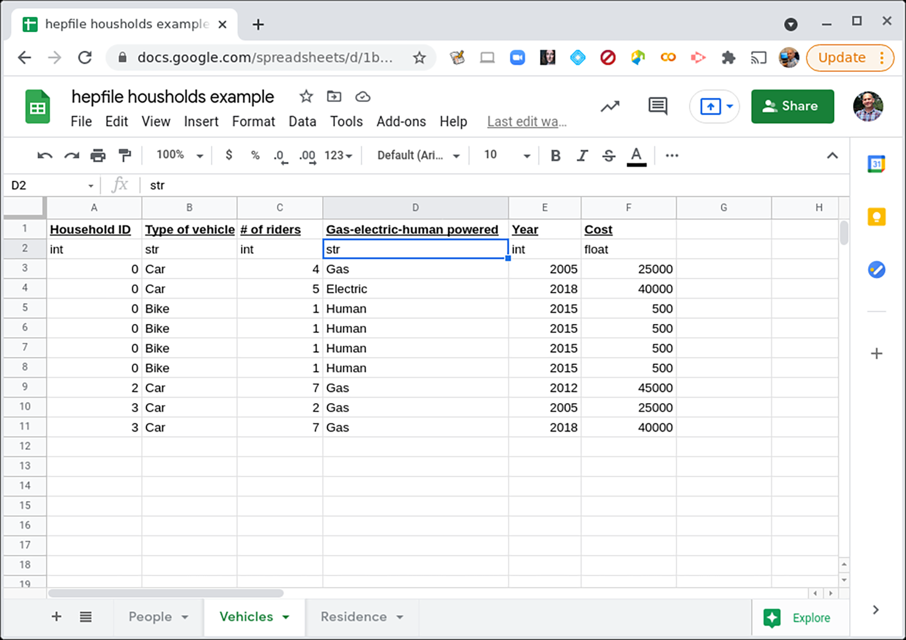
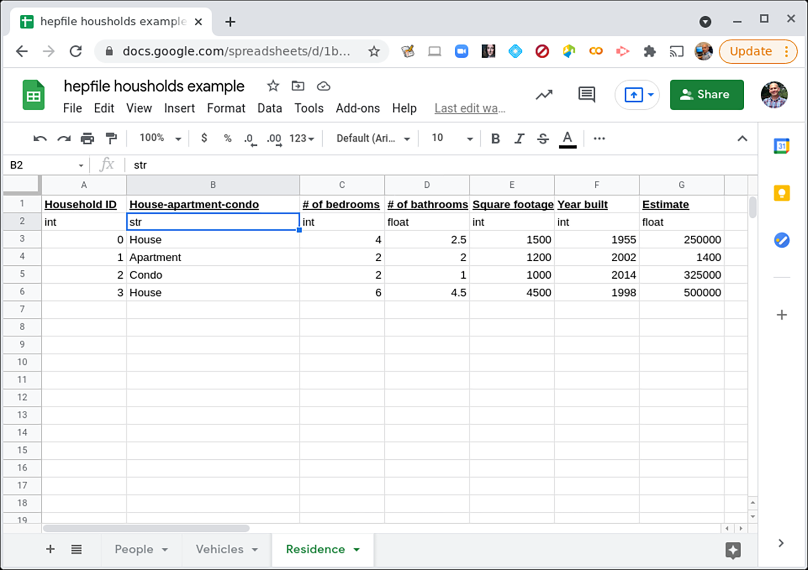

<!-- begin-logo -->

<!-- end-logo -->

[![Actions Status][actions-badge]][actions-link]
[![Documentation Status][rtd-badge]][rtd-link]
[![PyPI version][pypi-version]][pypi-link]
[![PyPI platforms][pypi-platforms]][pypi-link]
<!-- [![GitHub Discussion][github-discussions-badge]][github-discussions-link] -->

[](https://codecov.io/gh/mattbellis/hepfile)
[![Code style: black][black-badge]][black-link]
[](https://github.com/astral-sh/ruff)
[](https://mybinder.org/v2/gh/mattbellis/hepfile/HEAD?urlpath=lab/tree/docs/example_nb)
[](https://zenodo.org/badge/latestdoi/378834559)
<!-- [![Gitter][gitter-badge]][gitter-link] -->

[actions-badge]:            https://github.com/mattbellis/hepfile/workflows/CI/badge.svg
[actions-link]:             https://github.com/mattbellis/hepfile/actions
[black-badge]:              https://img.shields.io/badge/code%20style-black-000000.svg
[black-link]:               https://github.com/psf/black
[conda-badge]:              https://img.shields.io/conda/vn/conda-forge/hepfile
[conda-link]:               https://github.com/conda-forge/hepfile-feedstock
[github-discussions-badge]: https://img.shields.io/static/v1?label=Discussions&message=Ask&color=blue&logo=github
[github-discussions-link]:  https://github.com/mattbellis/hepfile/discussions
[gitter-badge]:             https://badges.gitter.im/https://github.com/mattbellis/hepfile/community.svg
[gitter-link]:              https://gitter.im/https://github.com/mattbellis/hepfile/community?utm_source=badge&utm_medium=badge&utm_campaign=pr-badge
[pypi-link]:                https://pypi.org/project/hepfile/
[pypi-platforms]:           https://img.shields.io/pypi/pyversions/hepfile
[pypi-version]:             https://badge.fury.io/py/hepfile.svg
[rtd-badge]:                https://readthedocs.org/projects/hepfile/badge/?version=latest
[rtd-link]:                 https://hepfile.readthedocs.io/en/latest/?badge=latest
[sk-badge]:                 https://scikit-hep.org/assets/images/Scikit--HEP-Project-blue.svg

# Heterogeneous Files in Parallel File (hepfile)

In high energy physics, experiments require file formats that can accomodate
heterogeneity (each collection event can have differing amounts of data collected)
and size (since HEP experiments can generate petabytes of data). Although the current
file format of choice is ROOT, a file format developed by CERN, we believe that
HDF5, which is a portable and more commonly used file format outside of HEP,
has promise in being a new standard.

The only issue is that HDF5 works best with homogenous data formats, where each
dataset occupies an n by m chunk of memory. This is not necessarily the case
for HEP data, but we addressed this issue using an organizational method outlined
in our schema.

# Schema

### Heterogenous Data ...

We assume that data that we collect is composed of (insert some term for particle,
chair, etc.) each carrying a certain number of attributes. Each ___ is associated
with some increasing counter. In HEP, this counter is events. Each event can
have an arbitrary number of particles of any type, making this data heterogenous.

### ... to Homogenous File

To make this data homogenous, we can create n by m chunks of data for each type
of particle, where n is the total number of this particle in all of the events,
and the specific row for each of the particles contains all of the attributes
for that particle in the original data.

We also create a list for each type of particle whose length is the total number
of events. At position *i*, we have the data for how many particles of said type
appeared in event *i*.

# Overview of use case

`hepfile` is useful for datasets where there are n columns with different numbers
of rows. In more "pythonic" language, you can imagine a dictionary where each key
has a different number of values. For example:
```
   data = {x: [1],
           y: [1, 2],
	   z: ['1', '2', '3']
   }
```
This can not simply be converted to most common data structures, like a Pandas DataFrame,
or written to a simple homogeneous file structure, like a CSV file. In a more complex case
Let's have an image of a town, with cartoon people here.

To illustrate how to use hepfile with this example, we imagine a researcher conducting
a census on a town. Each household in the town has some variable number of people
in it, some variable number of vehicles, and only one residence. The people, vehicles,
and residence all have different data associated with them. How would we record
these data? Well, to first order, we might decide to record them in multiple spreadsheets or
multiple .csv files.





One could also imagine this data stored in a database with each of the csv files as tables.
But the goal is to keep all of this data in one file, so that it is easier for someone to
do analysis. For example, someone might want to know the average number of people per bedroom,
in the homes. Or the average number of vehicles as a function of combined ages of the household
residents. If we have 3 separate files, this is more difficult to work with. What we want is one
file and a way to extract information, collected by *household*.

To do this, we need some way to count the number of people or vehicles in any household,
as well as keep track of what data fields will always have one entry per household (e.g. data
about the residence itself).

One could imagine building a very large [`pandas`](https://pandas.pydata.org/]) dataframe to do this
with a lot of join statements and then use `.groupby()` approach or to store this in a database and
then use a lot of SQL join statements. But we want to store this in a single file so. instead, we will
take our cue from ROOT and particle physicists, who are used to looping over subsets of their data.

# Installation
### User Installation
For non-developers, `hepfile` can be installed using `pip`.
`hepfile` includes some optional features that include optional dependencies so there are multiple
different options for installation.

The base package gives you the ability to read and write hepfiles using the more standard "loop & pack"
method and the dictionary tools. This is the "lightest" of the installation options and  is only dependent
on `numpy` and `h5py`. To install the base package use:
```
python -m pip install hepfile
```

You can also get the `awkward_tools` which is the hepfile integration with the awkward package. This is
especially recommended for High Energy Physicists who are used to working with awkward arrays. The only
dependency this add is `awkward`. To install this version of the package use:
```
python -m pip install hepfile[awkward]
```

You can get the more data science focused tools by installing the `df_tools` and `csv_tools`. These provide
integration with pandas and typical csv files. This is recommended for those who are used to working
with pandas in python. This adds a a `pandas` dependency to the base installation. To install this \
distribution use:
```
python -m pip install hepfile[pandas]
```

Finally, to get both the awkward and pandas integration with hepfile (which adds pandas and awkward
to the base installation dependencies) use:
```
python -m pip install hepfile[all]
```

The documentation for hepfile can be found at hepfile.readthedocs.io.

### Developer Installation
For local builds for testing follow these steps:
1. Clone this repo
2. Navigate to the top-level directory of this project (probably called hepfile)
3. We then recommend installing with the developer dependencies. To do this run:
```
python -m pip install -e .[dev]
```
4. Then, run the following command to setup the pre-commit git hook
to automatically run our code standard tests before committing!
```
pip install pre-commit
pre-commit install
```

As a side note, to test developments to the code use the following command in the top-level directory of
the project:
```
pytest
```
