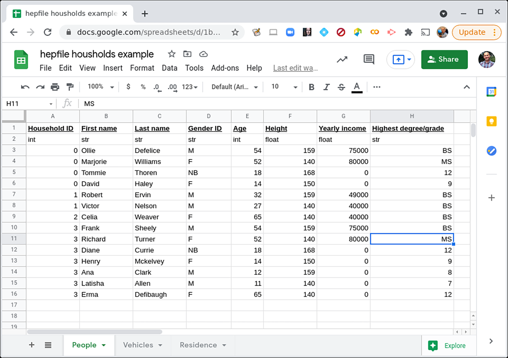
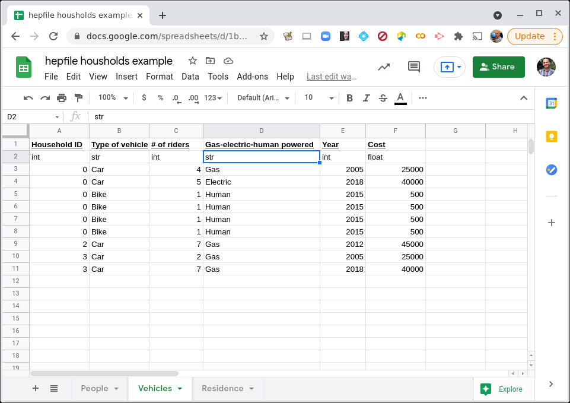
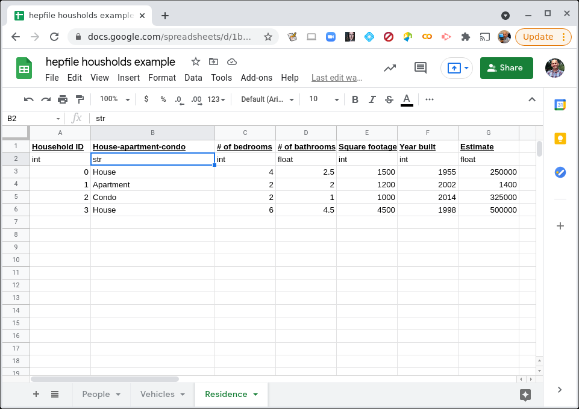

Fundamentals
=========================

A Toy Example
---------------

Let's have an image of a town, with cartoon people here. 

To illustrate how to use hepfile with example, we imagine a researcher conducting 
a census on a town. Each household in the town has some variable number of people
in it, some variable number of vehicles, and only one residence. The people, vehicles,
and residence all have different data associated with them. How would we record 
these data? Well, to first order, we might decide to record them in multiple spreadsheets or 
multiple .csv files. 

REFERENCE USING NAMES: https://pypi.org/project/names/
(PICTURE BELOW)

    Click on the image to see a fuller view of the data on the People.

    Click on the image to see a fuller view of the data on the Vehicles.

    Click on the image to see a fuller view of the data on the Residences.

Note that we also say what the datatype is. 

But the goal is to keep all of this data in one file, so that it is easier for someone to do analysis. 
For example, someone might want to know the average number of people per bedroom, in the homes. Or
the average number of vehicles as a function of combined ages of the household residents. If we have
3 separate files, this is more difficult to work with. What we want is one file and a way to extract information, 
collected by *household*.

To do this, we need some way to count the number of people or vehicles in any household, as well as keep 
track of what data fields will always have one entry per household (e.g. data about the residence itself).

One could imagine building a [`pandas`](https://pandas.pydata.org/]) dataframe to do this and use 
`.groupby()` approach. But instead, we will take our cue from ROOT and particle physicists, who are used
to looping over subsets of their data. In this case, we'd like to be able to read in all our data
on this town, and then loop over each household, performing whatever analysis we want on that household, 
accumulating the output of that analysis as we go. 

.. include:: schema.rst

In hepfile, all the data can be grouped into **buckets**, which in this case can be associated with
households (and the Household ID). *people* and *vehicles* would be separate **groups**, with all their data
being contained in **datasets** inside each group. With *houses*, there are two separate options:
one could either make a new group *houses*, or you could include all of its data in the 
**_SINGLETONS_GROUP_**, a special group designed to store all datasets where each bucket has one and only one
entry from it. Because we require every household to only have one house, each household has only one entry
from *# of bedrooms*, for example.

Writing Data with hepfile
---------------------------

Before anything, we extract the data from the .csv files. (Since *houses* will not be its own group,
it is not completely necessary to extract *houses_ID*.) ::

    people = np.loadtxt('sheet1.csv', unpack=True, dtype=str,
                        delimiter=",", comments = '$')[:, 1:]

    vehicles = np.loadtxt('sheet2.csv', unpack=True, dtype=str,
                        delimiter=",", comments = '$')[:, 1:]

    houses = np.loadtxt('sheet3.csv', unpack=True, dtype=str,
                        delimiter=",", comments = '$')[:, 1:]

    people_ID = people[0][1:].astype(np.int32)
    vehicles_ID = vehicles[0][1:].astype(np.int32)
    houses_ID = houses[0][1:].astype(np.int32)

We create the dictionary where we will be storing our data, and then create the groups inside it.
For brevity, the **counter** for the buckets will be *ID*. It is fine to repeat the name of the counter
because hepfile will store the counter dataset as ``f'{groupname}/ID'``. ::

    town = hepfile.initialize()
    hepfile.create_group(town, 'people', counter = 'ID')
    hepfile.create_group(town, 'vehicles', counter = 'ID')

We then create all of the datasets, both inside the created groups and _SINGLETONS_GROUP_. For the latter,
all we need to do is not specify the group name. By passing in a list, we can create many datasets at a time,
though all the data in the created datasets must be of the same type. ::

    hepfile.create_dataset(town, ['First name','Last name','Gender ID',
                                    'Highest degree/grade'], group = 'people', dtype = str)
    hepfile.create_dataset(town, ['Age', 'Height', 'Yearly Income'], group = 'people', dtype = int)

    hepfile.create_dataset(town, ['Type of vehicle','Gas/electric/human powered'], group = 'vehicles', dtype = str)
    hepfile.create_dataset(town, ['# of riders', 'Year', 'Cost'], group = 'vehicles', dtype = int)

    hepfile.create_dataset(town, ['houses/House/apartment/condo'], dtype = str)
    hepfile.create_dataset(town, ['houses/# of bedrooms', 'houses/Square footage','houses/Year built',
                                    'houses/Estimate'], dtype = int)
    hepfile.create_dataset(town, 'houses/# of bathrooms', dtype = float)

Finally, to begin packing in the data, we need to create a reusable bucket for storing the data for 
each household in the town. ::

    bucket = hepfile.create_single_bucket(town)

To call ``hepfile.pack`` when the bucket for the household is completely full, we loop over *people_ID* 
and *vehicle_ID* and check if the current bucket number matches the ID number for the row of data. 
If it does, we add the row of data to the bucket. We also increment the counter, since we need to tell
hepfile how many rows of data each group has in every bucket. For the data from the houses, we add the row 
directly corresponding to the  bucket we are in, since there is only one house. Once all the data is in,
we **pack** the bucket into *town*, which clears the bucket implicitly, preparing it for the next loop. ::

    for i in range(0,4):
    for j in range(len(people_ID)):
        if people_ID[j] == i:
            bucket['people/First name'].append(people[1, j])
            bucket['people/Last name'].append(people[2, j])
            bucket['people/Gender ID'].append(people[3, j])
            bucket['people/Age'].append(people[4, j].astype(np.int32))
            bucket['people/Height'].append(people[5, j].astype(np.int32))
            bucket['people/Yearly Income'].append(people[6, j].astype(np.int32))
            bucket['people/Highest degree/grade'].append(people[6, j])
            bucket['people/ID'] += 1
    
    for j in range(len(vehicles_ID)):
        if vehicles_ID[j] == i:
            bucket['vehicles/Type of vehicle'].append(vehicles[1, j+)
            bucket['vehicles/# of riders'].append(vehicles[2, j].astype(np.int32))
            bucket['vehicles/Gas/electric/human powered'].append(vehicles[3, j])
            bucket['vehicles/Year'].append(vehicles[4, j].astype(np.int32))
            bucket['vehicles/Cost'].append(vehicles[5, j].astype(np.int32))
            bucket['vehicles/ID'] += 1
    
    bucket['houses/House/apartment/condo'] = houses[1, i]
    bucket['houses/# of bedrooms'] = houses[2, i].astype(np.int32)
    bucket['houses/# of bathrooms'] = houses[3, i].astype(np.float32)
    bucket['houses/Square footage'] = houses[4, i].astype(np.int32)
    bucket['houses/Year built'] = houses[5, i].astype(np.int32)
    bucket['houses/Estimate'] = houses[6, i].astype(np.int32)
                        
    hep.pack(town, bucket)

Finally, we write the dictionary into our HDF5 file! ::

    hep.write_to_file('town_hep_long.hdf5', town,force_single_precision=False)

A complete program with all this code can be found in the examples folder, under csvreader_long.py,
and a more compact program that doesn't rely on manually inputting the columns can be found in 
csvreader.py.

Reading Data with hepfile
----------------------------

