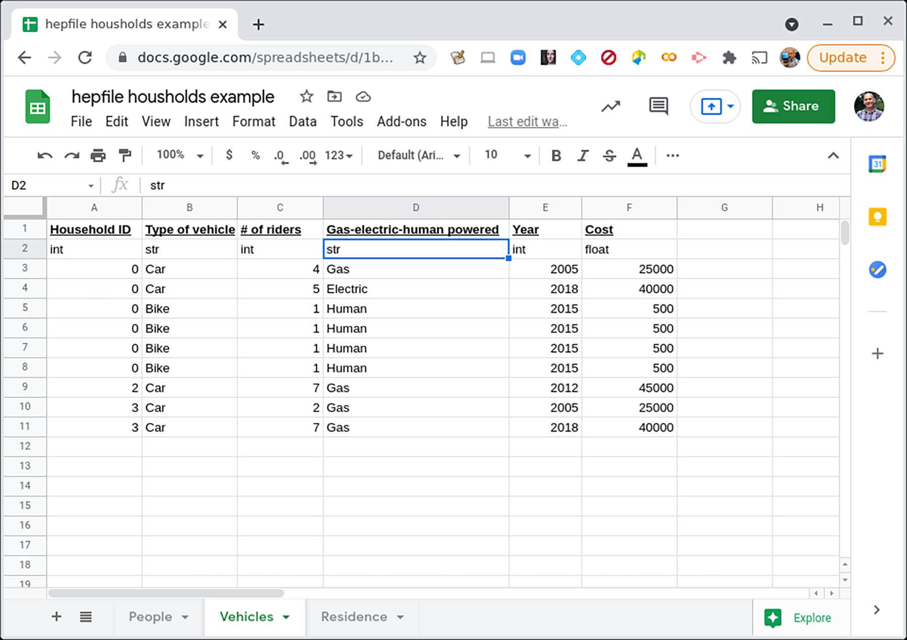
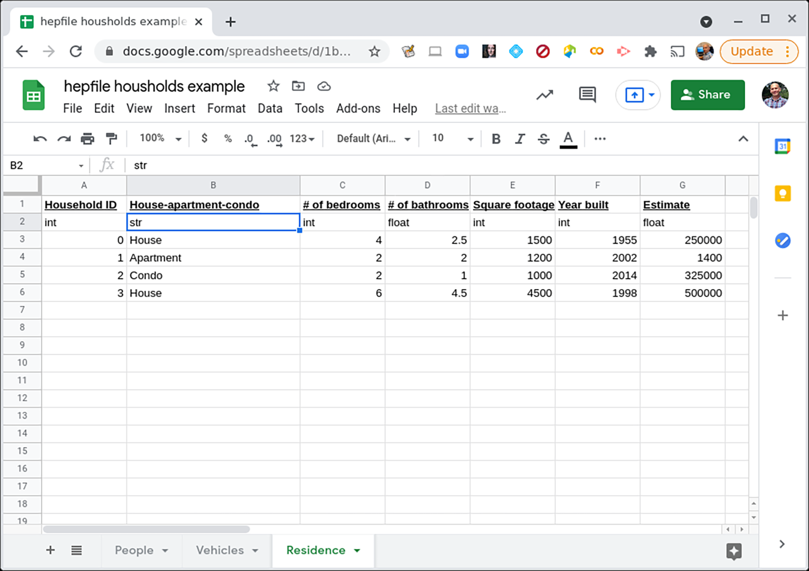

A Toy Example
---------------

Let's have an image of a town, with cartoon people here. 

To illustrate how to use hepfile with example, we imagine a researcher conducting 
a census on a town. Each household in the town has some variable number of people
in it, some variable number of vehicles, and only one residence. The people, vehicles,
and residence all have different data associated with them. How would we record 
these data? Well, to first order, we might decide to record them in multiple spreadsheets or 
multiple .csv files. 

REFERENCE USING NAMES: https://pypi.org/project/names/
(PICTURE BELOW)

.. figure:: ../images/household_example_spreadsheet_00.png 
    :scale: 30%
    :alt: Image of spreadsheet

    Click on the image to see a fuller view of the data on the People.

    Click on the image to see a fuller view of the data on the Vehicles.

    Click on the image to see a fuller view of the data on the Residences.

Note that we also say what the datatype is. 

But the goal is to keep all of this data in one file, so that it is easier for someone to do analysis. 
For example, someone might want to know the average number of people per bedroom, in the homes. Or
the average number of vehicles as a function of combined ages of the household residents. If we have
3 separate files, this is more difficult to work with. What we want is one file and a way to extract information, 
collected by *household*.

To do this, we need some way to count the number of people or vehicles in any household, as well as keep 
track of what data fields will always have one entry per household (e.g. data about the residence itself).

One could imagine building a [`pandas`](https://pandas.pydata.org/]) dataframe to do this and use 
`.groupby()` approach. But instead, we will take our cue from ROOT and particle physicists, who are used
to looping over subsets of their data. In this case, we'd like to be able to read in all our data
on this town, and then loop over each household, performing whatever analysis we want on that household, 
accumulating the output of that analysis as we go. 
